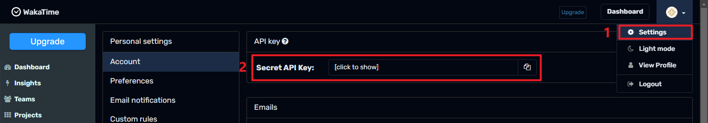

[English](README.md) | 中文

- # loseq-wakatime

  - 一个用于统计 [Logseq](https://logseq.com/) 写作时间的插件,基于 [WakaTime](https://wakatime.com/) 的 API

- ## 用法

  - 安装插件
  - 在设置中配置 WakaTime API key
    - 如何获取 WakaTime API key？
    - 

- ## 截图

  - 
  - 

- ## 许可证
  - [MIT](https://choosealicense.com/licenses/mit/)
