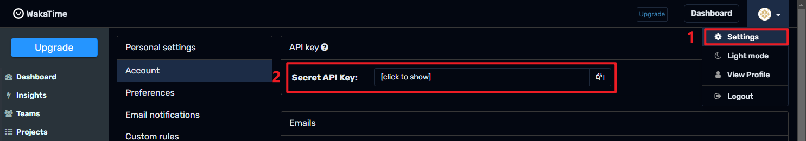
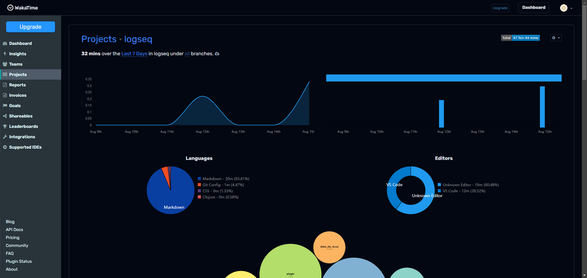

[中文](README.CN.md) | English

- # loseq-wakatime

  - A plugin for tracking writing time in [Logseq](https://logseq.com/), based on the [WakaTime](https://wakatime.com/) API.

- ## Usage

  - Install the plugin
  - Configure the WakaTime API key in the settings
    - How to get Wakatime API Key?
    - 

- ## Demo

  - 
  - 

- ## Licence
  - [MIT](https://choosealicense.com/licenses/mit/)
